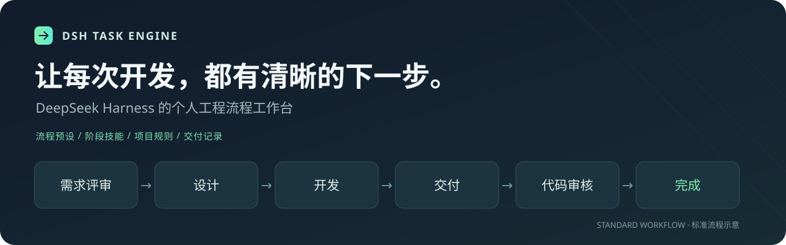

<p align="center">
  
</p>

<h1 align="center">DSH Task Engine</h1>

<p align="center">把开发步骤、技能规则和交付记录，放进一个个人工作台。</p>
<p align="center"><sub>A personal engineering workflow workbench for DeepSeek Harness.</sub></p>

<p align="center">
  <a href="https://www.npmjs.com/package/@godv61/dsh-task-engine"></a>
  <a href="https://github.com/godv61/dsh-task-engine/actions/workflows/verify.yml"></a>
  <a href="LICENSE"></a>
</p>

<p align="center">
  <a href="#快速开始">快速开始</a> ·
  <a href="#工作台里有什么">工作台</a> ·
  <a href="docs/README.md">使用文档</a> ·
  <a href="docs/roadmap.md">功能规划</a> ·
  <a href="docs/CHANGELOG.md">更新日志</a>
</p>

## 为什么用它

让 AI 修改代码时，你可以先明确需求，再检查方案、推进实施、验证结果，最后审核提交。DSH Task Engine 把这些步骤组织成可检查、可追踪的任务流程，适合在本机使用 DeepSeek Harness 开发个人项目。

- **知道下一步做什么**：按所选流程推进，当前阶段需要的条件和产物清楚可查。
- **复用自己的工作方法**：把技能和规则安装到项目或个人目录，再挂到对应阶段。
- **找得到过程记录**：任务台账集中查看阶段、实施项、验证与审核状态。

## 快速开始

需要已安装 DeepSeek Harness 和 pnpm。插件装入你使用的 Web profile；下面以 `web` 为例。

```sh
dsh plugin --profile web add @godv61/dsh-task-engine
```

1. 重启 Harness Web，打开侧边栏的 **工程流程**。
2. 选择工作区，在 **流程配置** 中选择一套流程。
3. 新建会话，选择 **工程化开发引擎** 预设，描述要完成的开发任务。

看到“工程流程”入口和“工程化开发引擎”会话预设，就说明工作台与任务工具已接入。使用 Harness 源码启动的安装方式见[安装与启用](docs/getting-started.md)。

> 工作台中的“流程预设”决定任务怎么推进；会话中的“工程化开发引擎”预设负责启用 `dev_task` 工具。两者作用不同。

## 工作台里有什么

| 页面 | 你可以做什么 |
| :--- | :--- |
| **项目初始化** | 查看或编辑 `AGENTS.md`，让 AI 生成项目说明，预览后保存。 |
| **流程配置** | 选择内置流程，为各阶段追加技能和规则。 |
| **任务台账** | 查看实施、验证和审核记录，按关键词、阶段或风险筛选。 |
| **技能** | 选择技能文件夹，预览内容与目标目录后安装；支持查看、编辑和删除。 |
| **规则** | 选择 Markdown 文件安装规则，维护项目或个人开发约定。 |

内置技能和规则只读；项目与个人资源可编辑。安装、删除都会明确展示目标位置。

## 选择适合这次任务的流程

| 预设 | 阶段顺序 | 适用场景 |
| :--- | :--- | :--- |
| **标准研发** `standard` | 需求评审 → 设计 → 开发 → 交付 → 代码审核 → 完成 | 需要需求、方案和交付检查的完整开发任务。 |
| **敏捷轻量** `agile` | 需求 → 开发 → 交付 → 审查 | 希望保留任务记录、减少阶段和产物的迭代。 |
| **纯代码** `minimal` | 开发 → 交付 | 已明确做法的小改动。 |

当前版本的阶段顺序和检查条件由预设固定，默认技能/规则绑定只能追加。**可视化自定义流程正在规划，尚未发布**，具体范围见[功能规划](docs/roadmap.md)。

## 把自己的技能和规则带进来

**选择文件 → 检查预览 → 选择范围 → 确认安装 → 挂到阶段。**

技能选择含 `SKILL.md` 的文件夹，规则选择一个 `.md` 文件。预览会显示名称、正文、文件数、体积和目标路径；同名资源不会被覆盖。

| 安装范围 | 存放位置 | 用途 |
| :--- | :--- | :--- |
| 项目 | 工作区 `.dsh/skills`、`.dsh/rules` | 当前项目的工作方法与约定。 |
| 个人 | `$DSH_HOME/skills`、`$DSH_HOME/rules` | 在这台电脑上的多个项目间复用。 |

技能的脚本、模板和附件会一并保留。文件格式、大小限制和故障处理见[技能与规则安装指南](docs/resource-install.md)。

## 使用文档

| 想了解什么 | 从这里开始 |
| :--- | :--- |
| 安装、启用与第一次使用 | [快速上手](docs/getting-started.md) |
| 项目配置与阶段绑定 | [流程配置](docs/configuration.md) |
| 技能文件夹与 Markdown 规则 | [资源安装](docs/resource-install.md) |
| 完整操作说明 | [HTML 手册](docs/manual.html)（下载后在浏览器打开） |
| 当前能力与常见问题 | [常见问题](docs/faq.md) |
| 本地开发与验证 | [开发指南](docs/development.md) |
| 本地候选版流程修复 | [回归迭代说明](docs/workflow-regression.md)（尚未发布） |
| 版本变化与验证记录 | [更新日志](docs/CHANGELOG.md) · [0.23.0 测试报告](docs/testing/0.23.0/测试报告.md) |

## 能力说明

`dev_task` 按配置检查阶段、产物和提交条件；高风险验证要求真实命令回执。任务保存创建时的流程快照，之后修改项目配置不会直接改变进行中的任务。

审核结论、实施项完成情况和测试覆盖面仍需要你判断。本地提交钩子提供即时检查，不能替代人工审核或项目自己的 CI。详细说明见[常见问题](docs/faq.md)。

---

[MIT License](LICENSE) · [反馈问题](https://github.com/godv61/dsh-task-engine/issues) · Built for DeepSeek Harness
