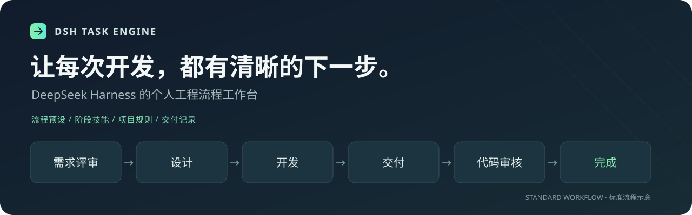

<p align="center">
  
</p>

<h1 align="center">DSH Task Engine</h1>

> 本分支的自适应流程、项目技能初始化与 SonarQube 审核仍在开发验证中；npm 上的 `0.28.0` 尚未包含这些功能。下方的新流程说明面向本分支源码。

<p align="center">按每个需求选择工程路径，用项目 Skill 与 Rule 复用团队开发规范。</p>
<p align="center"><sub>Task-scoped engineering workflows for DeepSeek Harness.</sub></p>

<p align="center">
  <a href="https://www.npmjs.com/package/@godv61/dsh-task-engine"></a>
  <a href="https://github.com/godv61/dsh-task-engine/actions/workflows/verify.yml"></a>
  <a href="https://awesome-dsh-plugin.com"></a>
  <a href="LICENSE"></a>
</p>

<p align="center">
  <a href="#快速开始">快速开始</a> ·
  <a href="#工作台里有什么">工作台</a> ·
  <a href="docs/README.md">使用文档</a> ·
  <a href="docs/roadmap.md">功能规划</a> ·
  <a href="docs/CHANGELOG.md">更新日志</a>
</p>

## 为什么用它

让 AI 在持续开发的项目中处理不同需求时，按这次需求的复杂度选择低、中、高、超高四档任务流程。元技能规定交接产物，项目 Skill/Rule 承载团队编码规范；同一项目下的多个会话可以各自推进不同任务。

- **知道下一步做什么**：任务创建时选择复杂度并冻结流程，当前阶段的条件和产物清楚可查。
- **复用自己的工作方法**：把技能和规则安装到项目或个人目录，将规则配置在技能下，再把技能挂到节点上；同一技能在任何节点都使用同一套约束。
- **找得到过程记录**：任务台账集中查看阶段、实施项、验证与审核状态。

## 快速开始

需要已安装 DeepSeek Harness 和 pnpm。插件装入你使用的 Web profile；下面以 `web` 为例。

```sh
dsh plugin --profile web add @godv61/dsh-task-engine
```

1. 重启 Harness Web，打开侧边栏的 **工程任务**。
2. 选择工作区，在 **自适应流程** 中查看四档路径，按需挂载项目技能。
3. 新建会话，选择 **工程化开发引擎** 预设，描述要完成的开发任务。

看到“工程任务”入口和“工程化开发引擎”会话预设，就说明工作台与任务工具已接入。使用 Harness 源码启动的安装方式见[安装与启用](docs/getting-started.md)。

> 工程化会话先分析需求复杂度，再以 `dev_task assess` 预览并创建任务；`.dsh/meta.json` 只配置元技能挂载和可选 SonarQube 审核，不强迫项目所有会话走同一条流程。

## 工作台里有什么

| 页面 | 你可以做什么 |
| :--- | :--- |
| **项目初始化** | 维护 `AGENTS.md`；工程会话可用 `dev_task init_project` 扫描仓库、预览并生成项目 Skill/Rule。 |
| **自适应流程** | 查看四档任务路径、元技能绑定与可选 SonarQube 审核配置。 |
| **旧版流程** | 维护旧项目的 `.dsh/eng.json`；已有任务继续按冻结快照执行。 |
| **任务台账** | 查看实施、验证和审核记录，按关键词、阶段或风险筛选。 |
| **技能** | 安装、编辑技能，并集中维护每个技能唯一的规则列表。 |
| **规则** | 选择 Markdown 文件安装规则，维护项目或个人开发约定。 |

插件内置会话编排 Skill `eng-delivery` 和六个通用元技能 Skill。项目知识、领域编码方法和 Rule 由使用者创建或通过 init 生成，可放在项目或个人目录；同名项目 Skill 在新任务中覆盖用户级 Skill。

新路径的四档顺序、元技能交接契约、`init_project` 和可选 SonarQube 审核见[自适应工程任务](docs/adaptive-workflows.md)。

**流程与工作方法是两回事。** 流程只决定工作怎么流转（阶段顺序与门禁），预设不自带任何技能或提交格式。要用什么技能、遵守哪些规则，都由你配置。「采用推荐配置」只填写可修改的提交文本、产物字段和评审深度，不改变技能与规则绑定。同一条规则可由多个技能共享。用户级技能及其规则配置由所有项目和会话共用。任务的流程与资源引用在创建时确定；Skill/Rule 正文在每次交互读取最新版本，创建时副本仅用于审计。[配置细节](docs/configuration.md)

## 旧版流程兼容

| 预设 | 阶段顺序 | 适用场景 |
| :--- | :--- | :--- |
| **完整研发** `standard` | 需求评审 → 设计 → 开发 → 交付 → 代码审核 → 完成 | 需要需求、方案和交付检查的完整开发任务。 |
| **日常迭代** `agile` | 需求 → 开发 → 交付 → 审查 | 目标明确的日常开发任务。 |
| **快速修改** `minimal` | 开发 → 交付 | 已明确做法的小改动。 |

旧版阶段顺序和检查条件继续有效；没有传入 `complexity` 的旧调用仍按 `.dsh/eng.json` 执行。新任务通过 `complexity` 使用四档自适应流程；旧任务不迁移或改写。

## 把自己的技能和规则带进来

**选择文件 → 检查预览 → 选择范围 → 确认安装 → 挂到阶段。**

技能选择含 `SKILL.md` 的文件夹，规则选择一个 `.md` 文件。预览会显示名称、正文、文件数、体积和目标路径；同名资源不会被覆盖。

| 安装范围 | 存放位置 | 用途 |
| :--- | :--- | :--- |
| 项目 | 工作区 `.dsh/skills`、`.dsh/rules` | 当前项目的工作方法与约定；工作台新建资源默认写在这里。 |
| 个人 | `$DSH_HOME/skills`、`$DSH_HOME/rules` | 在这台电脑上的多个项目间复用。 |

工作台也会发现同一项目 `.agents/skills/<名称>/SKILL.md` 中的 Codex 项目技能，可将它绑定到流程节点，并在技能下配置 DSH 规则；它的正文仍留在原目录。运行时使用 `dev_task` 的 `load_skill` 操作读取该技能及其规则，下一次读取会取得文件的最新内容。[Codex 项目技能说明](docs/configuration.md#技能与规则)

技能的脚本、模板和附件会一并保留。文件格式、大小限制和故障处理见[技能与规则安装指南](docs/resource-install.md)。

## 使用文档

| 想了解什么 | 从这里开始 |
| :--- | :--- |
| 安装、启用与第一次使用 | [快速上手](docs/getting-started.md) |
| 任务级流程、元技能与 SonarQube | [自适应工程任务](docs/adaptive-workflows.md) |
| 旧项目配置与阶段绑定 | [流程配置](docs/configuration.md) |
| 技能文件夹与 Markdown 规则 | [资源安装](docs/resource-install.md) |
| 完整操作说明 | [HTML 手册](docs/manual.html)（下载后在浏览器打开） |
| 当前能力与常见问题 | [常见问题](docs/faq.md) |
| 本地开发与验证 | [开发指南](docs/development.md) |
| 真实项目回归修复 | [0.23.1 发布说明](docs/releases/0.23.1.md) · [回归迭代说明](docs/workflow-regression.md) |
| 版本变化与验证记录 | [更新日志](docs/CHANGELOG.md) · [0.23.1 测试说明](docs/testing/0.23.1/测试报告.md) |

## 能力说明

`dev_task` 按配置检查阶段、产物和提交条件。新任务的验证要求真实命令回执；技能可按自身配置要求命令、产物、审核、人工批准或无需额外证据，执行义务可在任务状态中查看。任务保存创建时的流程与资源引用；之后修改流程配置不会改变进行中任务的状态机，编辑所引用资源的正文会从下一次交互生效。

审核结论、实施项完成情况和测试覆盖面仍需要你判断。本地提交钩子提供即时检查，不能替代人工审核或项目自己的 CI。详细说明见[常见问题](docs/faq.md)。

小修正允许主代理处理，仍须审核和验证。遇到沙箱权限拒绝应使用宿主审批或报告阻塞，不能靠反复切换命令规避。

状态查询会列出过期验证和附加技能回执；`commit.allowed` 同时检查这些阻塞，文件变化后先补验证再申请提交。

验证命令的单次权限重试先审批后执行，不改变会话权限；操作方式见[验证权限说明](docs/faq.md#验证命令被沙箱阻止怎么办)。

记录需求、方案或评审前，模型可从 `artifact_requirements` 获取当前阶段允许的字段和缺项，避免猜测字段名。

---

[MIT License](LICENSE) · [反馈问题](https://github.com/godv61/dsh-task-engine/issues) · Built for DeepSeek Harness
